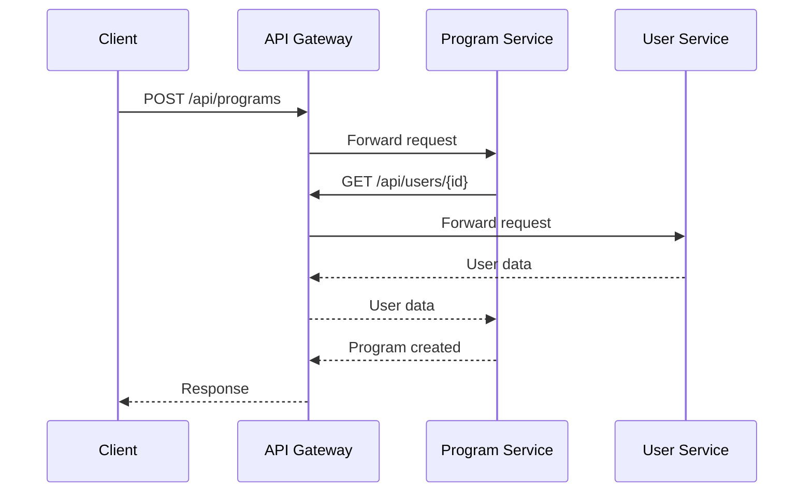
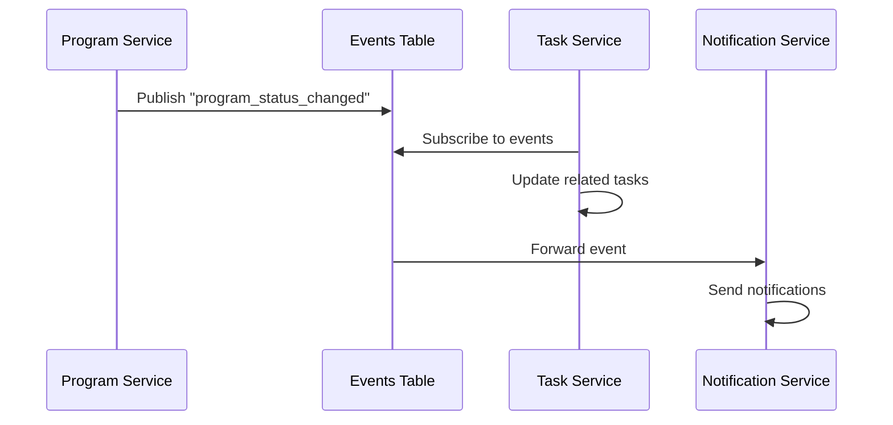

# Arsitektur Microservices untuk Proker Tracker

## Gambaran Umum

Arsitektur microservices untuk Proker Tracker dirancang dengan pendekatan Domain-Driven Design (DDD) dalam struktur monorepo. Pendekatan ini memungkinkan pemisahan concern berdasarkan domain bisnis sambil tetap mempertahankan kemudahan pengelolaan kode.

## Komponen Utama

### 1. Frontend (Next.js)

Frontend akan tetap menggunakan Next.js dengan App Router, tetapi akan dikonfigurasi untuk berkomunikasi dengan microservices melalui API Gateway.

### 2. API Gateway

API Gateway bertindak sebagai titik masuk tunggal untuk semua permintaan API. Ini akan diimplementasikan menggunakan Next.js API Routes yang akan meneruskan permintaan ke microservice yang sesuai.

### 3. Microservices

Aplikasi akan dibagi menjadi beberapa microservices berdasarkan domain bisnis:

#### Auth Service

Bertanggung jawab untuk autentikasi dan otorisasi.

**Fitur:**
- Login
- Registrasi
- Logout
- Verifikasi token
- Manajemen sesi

**Teknologi:**
- Supabase Auth
- Next.js API Routes
- JWT

#### User Service

Mengelola data pengguna dan profil.

**Fitur:**
- Manajemen profil pengguna
- Pengaturan pengguna
- Manajemen preferensi

**Teknologi:**
- Supabase Database (schema: user_service)
- Next.js API Routes

#### Organization Service

Mengelola data organisasi dan departemen.

**Fitur:**
- Manajemen organisasi
- Manajemen departemen
- Manajemen anggota organisasi

**Teknologi:**
- Supabase Database (schema: organization_service)
- Next.js API Routes

#### Program Service

Mengelola program kerja.

**Fitur:**
- Pembuatan program kerja
- Pengeditan program kerja
- Pelacakan status program kerja
- Laporan program kerja

**Teknologi:**
- Supabase Database (schema: program_service)
- Next.js API Routes
- Supabase Edge Functions untuk logika bisnis kompleks

#### Task Service

Mengelola tugas-tugas dalam program kerja.

**Fitur:**
- Pembuatan tugas
- Penugasan tugas
- Pelacakan status tugas
- Notifikasi tugas

**Teknologi:**
- Supabase Database (schema: task_service)
- Next.js API Routes
- Supabase Realtime untuk notifikasi

### 4. Database

Setiap microservice akan memiliki schema database terpisah di Supabase untuk memastikan isolasi data.

### 5. Event Bus

Untuk komunikasi asinkron antar service, akan digunakan pola event-driven dengan Supabase Realtime dan tabel events khusus.

## Komunikasi Antar Service

### Synchronous Communication

Untuk komunikasi sinkron, service akan memanggil API dari service lain melalui API Gateway.

### Asynchronous Communication

Untuk komunikasi asinkron, service akan mempublikasikan event yang dapat dikonsumsi oleh service lain.

## Deployment

Arsitektur ini akan di-deploy menggunakan:

1. **Netlify** untuk hosting frontend dan API Gateway
2. **Supabase** untuk database, autentikasi, dan serverless functions

## Monitoring dan Observability

Untuk monitoring dan observability, akan diimplementasikan:

1. **Dashboard Monitoring** untuk memvisualisasikan status dan metrik microservices
2. **Logging** menggunakan Supabase Edge Functions Logs
3. **Alerting** menggunakan webhook ke Discord atau Slack

## Keamanan

Keamanan akan diimplementasikan pada beberapa level:

1. **API Gateway** untuk autentikasi dan otorisasi
2. **Row Level Security (RLS)** di Supabase untuk keamanan data
3. **JWT** untuk komunikasi antar service
4. **CORS** untuk keamanan browser
