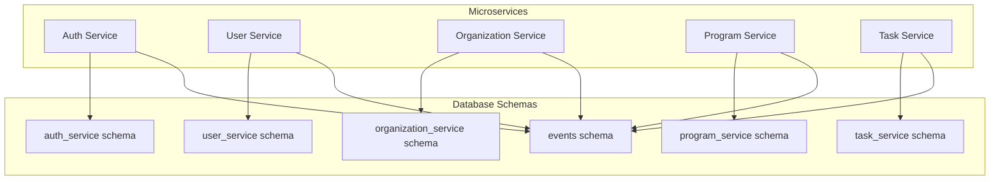

# Panduan Implementasi Microservices

## Pendekatan Rapid Application Development (RAD)

Implementasi microservices untuk Proker Tracker akan menggunakan pendekatan Rapid Application Development (RAD) yang berfokus pada pengembangan cepat dan iteratif. Pendekatan ini cocok untuk proyek akademis dan demonstrasi konsep.

## Tahapan Implementasi

### Fase 1: Persiapan (2 hari)

#### 1.1 Setup Proyek

```bash
# Buat proyek Next.js baru
npx create-next-app proker-tracker-microservices
cd proker-tracker-microservices

# Install dependensi
npm install @supabase/supabase-js @supabase/auth-helpers-nextjs
npm install tailwindcss postcss autoprefixer
npm install chart.js react-chartjs-2
npm install date-fns
npm install jsonwebtoken
```

#### 1.2 Setup Supabase

1. Buat akun Supabase (gratis): [https://supabase.com/](https://supabase.com/)
2. Buat proyek baru
3. Catat URL dan API Key untuk konfigurasi

#### 1.3 Konfigurasi Proyek

```javascript
// lib/supabase.js
import { createClient } from '@supabase/supabase-js';

const supabaseUrl = process.env.NEXT_PUBLIC_SUPABASE_URL;
const supabaseAnonKey = process.env.NEXT_PUBLIC_SUPABASE_ANON_KEY;

export const supabase = createClient(supabaseUrl, supabaseAnonKey);
```

```javascript
// .env.local
NEXT_PUBLIC_SUPABASE_URL=your-supabase-url
NEXT_PUBLIC_SUPABASE_ANON_KEY=your-supabase-anon-key
JWT_SECRET=your-jwt-secret
```

### Fase 2: Struktur Proyek (1 hari)

Buat struktur folder sesuai dengan arsitektur microservices:

```
/proker-tracker-microservices
  /src
    /services
      /auth
        /api
        /models
        /utils
      /users
        /api
        /models
        /utils
      /organizations
        /api
        /models
        /utils
      /programs
        /api
        /models
        /utils
      /tasks
        /api
        /models
        /utils
    /shared
      /supabase
      /utils
      /middleware
    /pages
      /api
        /auth/[...path].js
        /users/[...path].js
        /organizations/[...path].js
        /programs/[...path].js
        /tasks/[...path].js
      /admin
        /services.js
      # Halaman frontend lainnya
    /components
    /styles
  /supabase
    /migrations
    /functions
```

### Fase 3: Setup Database (2 hari)

#### 3.1 Buat Schema Database

```sql
-- Schema untuk Auth Service
CREATE SCHEMA auth_service;

-- Schema untuk User Service
CREATE SCHEMA user_service;

-- Schema untuk Organization Service
CREATE SCHEMA organization_service;

-- Schema untuk Program Service
CREATE SCHEMA program_service;

-- Schema untuk Task Service
CREATE SCHEMA task_service;
```

#### 3.2 Buat Tabel untuk Setiap Service

```sql
-- Tabel untuk User Service
CREATE TABLE user_service.profiles (
  id UUID REFERENCES auth.users(id) PRIMARY KEY,
  name TEXT NOT NULL,
  email TEXT NOT NULL,
  organization_id UUID,
  role TEXT NOT NULL,
  created_at TIMESTAMP WITH TIME ZONE DEFAULT NOW(),
  updated_at TIMESTAMP WITH TIME ZONE DEFAULT NOW()
);

-- Tabel untuk Organization Service
CREATE TABLE organization_service.organizations (
  id UUID PRIMARY KEY DEFAULT uuid_generate_v4(),
  name TEXT NOT NULL,
  description TEXT,
  university TEXT,
  faculty TEXT,
  department TEXT,
  logo TEXT,
  created_at TIMESTAMP WITH TIME ZONE DEFAULT NOW(),
  updated_at TIMESTAMP WITH TIME ZONE DEFAULT NOW()
);

CREATE TABLE organization_service.departments (
  id UUID PRIMARY KEY DEFAULT uuid_generate_v4(),
  name TEXT NOT NULL,
  description TEXT,
  organization_id UUID REFERENCES organization_service.organizations(id),
  head_id UUID,
  created_at TIMESTAMP WITH TIME ZONE DEFAULT NOW(),
  updated_at TIMESTAMP WITH TIME ZONE DEFAULT NOW()
);

-- Tabel untuk Program Service
CREATE TABLE program_service.programs (
  id UUID PRIMARY KEY DEFAULT uuid_generate_v4(),
  name TEXT NOT NULL,
  description TEXT,
  status TEXT NOT NULL DEFAULT 'belum_dimulai',
  start_date DATE NOT NULL,
  end_date DATE NOT NULL,
  budget INTEGER,
  department_id UUID,
  pic_id UUID,
  organization_id UUID NOT NULL,
  created_by UUID REFERENCES auth.users(id),
  created_at TIMESTAMP WITH TIME ZONE DEFAULT NOW(),
  updated_at TIMESTAMP WITH TIME ZONE DEFAULT NOW()
);

-- Tabel untuk Task Service
CREATE TABLE task_service.tasks (
  id UUID PRIMARY KEY DEFAULT uuid_generate_v4(),
  name TEXT NOT NULL,
  description TEXT,
  status TEXT NOT NULL DEFAULT 'belum_dimulai',
  priority TEXT NOT NULL DEFAULT 'sedang',
  due_date DATE,
  program_id UUID,
  assigned_to UUID,
  created_by UUID REFERENCES auth.users(id),
  created_at TIMESTAMP WITH TIME ZONE DEFAULT NOW(),
  updated_at TIMESTAMP WITH TIME ZONE DEFAULT NOW()
);

-- Tabel untuk Events (komunikasi antar service)
CREATE TABLE events.service_events (
  id UUID PRIMARY KEY DEFAULT uuid_generate_v4(),
  event_type TEXT NOT NULL,
  source_service TEXT NOT NULL,
  target_service TEXT,
  payload JSONB,
  processed BOOLEAN DEFAULT FALSE,
  created_at TIMESTAMP WITH TIME ZONE DEFAULT NOW()
);
```

#### 3.3 Setup Row Level Security (RLS)

```sql
-- RLS untuk User Service
ALTER TABLE user_service.profiles ENABLE ROW LEVEL SECURITY;

CREATE POLICY "Users can view their own profile" 
  ON user_service.profiles FOR SELECT 
  USING (auth.uid() = id);

CREATE POLICY "Users can update their own profile" 
  ON user_service.profiles FOR UPDATE 
  USING (auth.uid() = id);

-- RLS untuk Organization Service
ALTER TABLE organization_service.organizations ENABLE ROW LEVEL SECURITY;

CREATE POLICY "Users can view organizations they belong to" 
  ON organization_service.organizations FOR SELECT 
  USING (
    EXISTS (
      SELECT 1 FROM user_service.profiles
      WHERE user_service.profiles.id = auth.uid()
      AND user_service.profiles.organization_id = organization_service.organizations.id
    )
  );

-- RLS untuk Program Service
ALTER TABLE program_service.programs ENABLE ROW LEVEL SECURITY;

CREATE POLICY "Users can view programs in their organization" 
  ON program_service.programs FOR SELECT 
  USING (
    EXISTS (
      SELECT 1 FROM user_service.profiles
      WHERE user_service.profiles.id = auth.uid()
      AND user_service.profiles.organization_id = program_service.programs.organization_id
    )
  );
```

### Fase 4: Implementasi Auth Service (2 hari)

#### 4.1 Implementasi API

```javascript
// services/auth/api/login.js
import { supabase } from '@/shared/supabase/client';
import { logger } from '@/shared/utils/logger';

export async function login(email, password) {
  logger.info('Auth service: login attempt', { email });
  
  try {
    const { data, error } = await supabase.auth.signInWithPassword({
      email,
      password,
    });
    
    if (error) {
      logger.error('Auth service: login failed', { error: error.message, email });
      throw error;
    }
    
    logger.info('Auth service: login successful', { userId: data.user.id });
    return { success: true, data };
  } catch (error) {
    return { success: false, error: error.message };
  }
}
```

```javascript
// pages/api/auth/[...path].js
import { login } from '@/services/auth/api/login';
import { register } from '@/services/auth/api/register';
import { logout } from '@/services/auth/api/logout';
import { verifyToken } from '@/services/auth/api/verify-token';
import { loggingMiddleware } from '@/shared/middleware/logging-middleware';

async function handler(req, res) {
  const { path } = req.query;
  const endpoint = path[0];
  
  switch (endpoint) {
    case 'login':
      if (req.method === 'POST') {
        const { email, password } = req.body;
        const result = await login(email, password);
        
        if (!result.success) {
          return res.status(401).json({ error: result.error });
        }
        
        return res.status(200).json(result.data);
      }
      break;
      
    case 'register':
      if (req.method === 'POST') {
        const result = await register(req.body);
        
        if (!result.success) {
          return res.status(400).json({ error: result.error });
        }
        
        return res.status(201).json(result.data);
      }
      break;
      
    case 'logout':
      if (req.method === 'POST') {
        const result = await logout(req);
        return res.status(200).json({ message: 'Logout successful' });
      }
      break;
      
    case 'verify':
      if (req.method === 'GET') {
        const token = req.headers.authorization?.split(' ')[1];
        
        if (!token) {
          return res.status(401).json({ error: 'No token provided' });
        }
        
        const result = await verifyToken(token);
        
        if (!result.success) {
          return res.status(401).json({ error: result.error });
        }
        
        return res.status(200).json(result.data);
      }
      break;
      
    case 'health':
      return res.status(200).json({ status: 'healthy', latency: '5ms' });
      
    default:
      return res.status(404).json({ error: 'Endpoint not found' });
  }
  
  return res.status(405).json({ error: 'Method not allowed' });
}

export default loggingMiddleware(handler);
```

### Fase 5: Implementasi User Service (2 hari)

#### 5.1 Implementasi API

```javascript
// services/users/api/get-user.js
import { supabase } from '@/shared/supabase/client';
import { logger } from '@/shared/utils/logger';

export async function getUserById(userId, authToken) {
  logger.info('User service: getting user by ID', { userId });
  
  try {
    // Set auth header for RLS
    supabase.auth.setAuth(authToken);
    
    const { data, error } = await supabase
      .from('user_service.profiles')
      .select('*')
      .eq('id', userId)
      .single();
    
    if (error) throw error;
    
    return { success: true, data };
  } catch (error) {
    logger.error('User service: failed to get user', { userId, error: error.message });
    return { success: false, error: error.message };
  }
}
```

```javascript
// pages/api/users/[...path].js
import { getUserById } from '@/services/users/api/get-user';
import { updateUser } from '@/services/users/api/update-user';
import { listUsers } from '@/services/users/api/list-users';
import { authMiddleware } from '@/shared/middleware/auth-middleware';
import { loggingMiddleware } from '@/shared/middleware/logging-middleware';

async function handler(req, res) {
  // Implementasi API endpoint untuk User Service
  // ...
}

export default loggingMiddleware(authMiddleware(handler));
```

### Fase 6: Implementasi Program Service (2 hari)

#### 6.1 Implementasi API

```javascript
// services/programs/api/create-program.js
import { supabase } from '@/shared/supabase/client';
import { logger } from '@/shared/utils/logger';

export async function createProgram(programData, authToken) {
  logger.info('Program service: creating program', { programName: programData.name });
  
  try {
    // Set auth header for RLS
    supabase.auth.setAuth(authToken);
    
    // Get user data from auth token
    const { data: { user } } = await supabase.auth.getUser(authToken);
    
    // Get user profile to get organization_id
    const { data: userProfile } = await supabase
      .from('user_service.profiles')
      .select('organization_id')
      .eq('id', user.id)
      .single();
    
    // Create program
    const { data, error } = await supabase
      .from('program_service.programs')
      .insert({
        ...programData,
        organization_id: userProfile.organization_id,
        created_by: user.id
      })
      .select()
      .single();
    
    if (error) throw error;
    
    // Publish event for other services
    await supabase
      .from('events.service_events')
      .insert({
        event_type: 'program_created',
        source_service: 'program_service',
        target_service: 'task_service',
        payload: {
          program_id: data.id,
          program_name: data.name,
          organization_id: data.organization_id
        }
      });
    
    logger.info('Program service: program created successfully', { programId: data.id });
    return { success: true, data };
  } catch (error) {
    logger.error('Program service: failed to create program', { error: error.message });
    return { success: false, error: error.message };
  }
}
```

### Fase 7: Implementasi Task Service (2 hari)

#### 7.1 Implementasi API

```javascript
// services/tasks/api/create-task.js
import { supabase } from '@/shared/supabase/client';
import { logger } from '@/shared/utils/logger';

export async function createTask(taskData, authToken) {
  logger.info('Task service: creating task', { taskName: taskData.name });
  
  try {
    // Implementasi pembuatan task
    // ...
    
    return { success: true, data };
  } catch (error) {
    logger.error('Task service: failed to create task', { error: error.message });
    return { success: false, error: error.message };
  }
}
```

### Fase 8: Implementasi Event Handling (1 hari)

```javascript
// services/events/event-handler.js
import { supabase } from '@/shared/supabase/client';
import { logger } from '@/shared/utils/logger';

export async function handleProgramCreatedEvent(event) {
  const { program_id, program_name } = event.payload;
  
  logger.info('Event handler: handling program_created event', { program_id });
  
  try {
    // Implementasi penanganan event program_created
    // Misalnya, buat task default untuk program baru
    
    // Mark event as processed
    await supabase
      .from('events.service_events')
      .update({ processed: true })
      .eq('id', event.id);
    
    return { success: true };
  } catch (error) {
    logger.error('Event handler: failed to handle program_created event', { error: error.message });
    return { success: false, error: error.message };
  }
}
```

### Fase 9: Implementasi Dashboard Monitoring (1 hari)

```javascript
// pages/admin/services.js
import { useState, useEffect } from 'react';
import { supabase } from '@/shared/supabase/client';
import { Bar, Line } from 'react-chartjs-2';

export default function ServicesDashboard() {
  const [services, setServices] = useState([]);
  const [metrics, setMetrics] = useState({});
  const [loading, setLoading] = useState(true);
  
  useEffect(() => {
    async function fetchServiceStatus() {
      try {
        // Fetch status dari setiap service
        const authStatus = await fetch('/api/auth/health').then(res => res.json());
        const userStatus = await fetch('/api/users/health').then(res => res.json());
        const programStatus = await fetch('/api/programs/health').then(res => res.json());
        const taskStatus = await fetch('/api/tasks/health').then(res => res.json());
        
        setServices([
          { 
            name: 'Auth Service', 
            status: authStatus.status, 
            latency: authStatus.latency,
            lastError: authStatus.lastError,
            uptime: authStatus.uptime
          },
          // ... service lainnya
        ]);
        
        // Fetch metrik dari database
        // ...
        
      } catch (error) {
        console.error('Error fetching service metrics:', error);
      } finally {
        setLoading(false);
      }
    }
    
    fetchServiceStatus();
    const interval = setInterval(fetchServiceStatus, 60000); // Refresh every minute
    
    return () => clearInterval(interval);
  }, []);
  
  // Render dashboard
  // ...
}
```

### Fase 10: Deployment (1 hari)

#### 10.1 Setup Netlify

1. Buat akun Netlify (gratis): [https://netlify.com/](https://netlify.com/)
2. Hubungkan repositori GitHub
3. Konfigurasi build settings:
   - Build command: `npm run build`
   - Publish directory: `.next`
4. Konfigurasi environment variables:
   - `NEXT_PUBLIC_SUPABASE_URL`
   - `NEXT_PUBLIC_SUPABASE_ANON_KEY`
   - `JWT_SECRET`

#### 10.2 Deploy

```bash
# Deploy ke Netlify
git push origin main
```

## Pengujian Implementasi

### 1. Pengujian Unit

Buat unit test untuk setiap service:

```javascript
// __tests__/services/auth/login.test.js
import { login } from '@/services/auth/api/login';

// Mock Supabase
jest.mock('@/shared/supabase/client', () => ({
  supabase: {
    auth: {
      signInWithPassword: jest.fn()
    }
  }
}));

describe('Auth Service - Login', () => {
  it('should return success with valid credentials', async () => {
    // Arrange
    const mockUser = { id: '123', email: 'test@example.com' };
    const mockResponse = { data: { user: mockUser }, error: null };
    require('@/shared/supabase/client').supabase.auth.signInWithPassword.mockResolvedValue(mockResponse);
    
    // Act
    const result = await login('test@example.com', 'password');
    
    // Assert
    expect(result.success).toBe(true);
    expect(result.data).toEqual(mockResponse.data);
  });
  
  // Test case lainnya
});
```

### 2. Pengujian Integrasi

Buat pengujian integrasi untuk menguji komunikasi antar service:

```javascript
// __tests__/integration/program-creation.test.js
import { createProgram } from '@/services/programs/api/create-program';
import { login } from '@/services/auth/api/login';

describe('Program Creation Flow', () => {
  it('should create a program and publish an event', async () => {
    // Login first to get auth token
    const loginResult = await login('test@example.com', 'password');
    expect(loginResult.success).toBe(true);
    
    const authToken = loginResult.data.session.access_token;
    
    // Create program
    const programData = {
      name: 'Test Program',
      description: 'Test Description',
      start_date: '2023-01-01',
      end_date: '2023-12-31',
      department_id: '123',
      pic_id: '456'
    };
    
    const result = await createProgram(programData, authToken);
    
    expect(result.success).toBe(true);
    expect(result.data.name).toBe('Test Program');
    
    // Check if event was published
    const { data: events } = await supabase
      .from('events.service_events')
      .select('*')
      .eq('event_type', 'program_created')
      .eq('payload->program_name', 'Test Program');
    
    expect(events.length).toBeGreaterThan(0);
  });
});
```

### 3. Pengujian End-to-End

Buat pengujian end-to-end menggunakan Playwright:

```javascript
// e2e/program-workflow.spec.js
import { test, expect } from '@playwright/test';

test('complete program workflow', async ({ page }) => {
  // Login
  await page.goto('/login');
  await page.fill('#email', 'test@example.com');
  await page.fill('#password', 'password');
  await page.click('button[type="submit"]');
  
  // Wait for dashboard to load
  await page.waitForURL('/dashboard');
  
  // Create program
  await page.click('a[href="/dashboard/programs/create"]');
  await page.fill('#name', 'E2E Test Program');
  await page.fill('#description', 'Program created during E2E test');
  // Fill other fields
  await page.click('button[type="submit"]');
  
  // Verify program was created
  await page.waitForURL('/dashboard/programs');
  const programTitle = await page.textContent('.program-card:first-child .program-title');
  expect(programTitle).toBe('E2E Test Program');
  
  // Create task for the program
  await page.click('.program-card:first-child a.view-details');
  await page.click('button.add-task');
  await page.fill('#task-name', 'E2E Test Task');
  await page.fill('#task-description', 'Task created during E2E test');
  // Fill other fields
  await page.click('button[type="submit"]');
  
  // Verify task was created
  const taskTitle = await page.textContent('.task-card:first-child .task-title');
  expect(taskTitle).toBe('E2E Test Task');
});
```

## Pembuktian Implementasi Microservices

### 1. Visualisasi Pemisahan Domain

Buat diagram yang menunjukkan pemisahan schema database dan service:



### 2. Demonstrasi Isolasi Kegagalan

Buat script untuk mensimulasikan kegagalan pada satu service:

```javascript
// scripts/simulate-failure.js
// Simulasikan kegagalan pada Program Service
// Tambahkan delay yang sangat panjang atau error pada endpoint program service
```

### 3. Visualisasi Komunikasi Antar Service

Buat dashboard yang menampilkan komunikasi antar service:

```javascript
// pages/admin/service-communication.js
// Implementasi dashboard untuk visualisasi komunikasi antar service
```

## Kesimpulan

Dengan mengikuti panduan implementasi ini, Anda akan dapat mengimplementasikan arsitektur microservices untuk Proker Tracker dengan pendekatan Rapid Application Development. Pendekatan ini memungkinkan Anda untuk mendapatkan manfaat dari arsitektur microservices sambil tetap mempertahankan efisiensi pengembangan.

Implementasi ini cocok untuk tujuan akademis dan demonstrasi konsep, dan dapat diselesaikan dalam waktu sekitar 16 hari kerja dengan satu pengembang.
